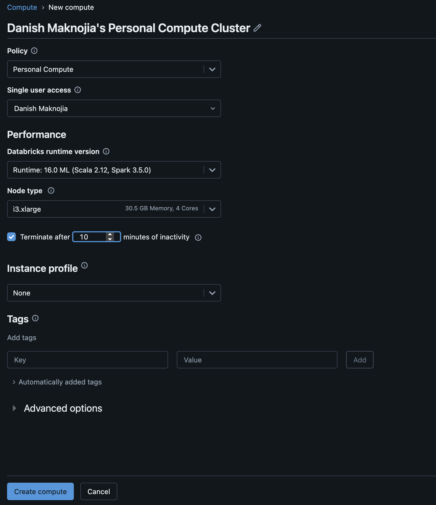
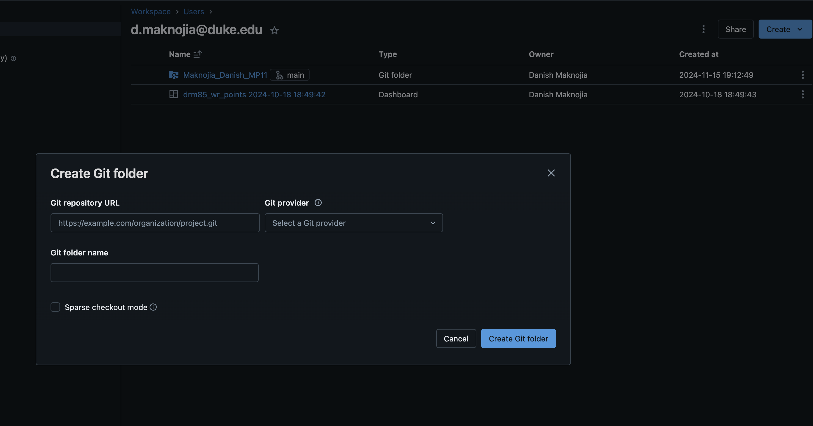
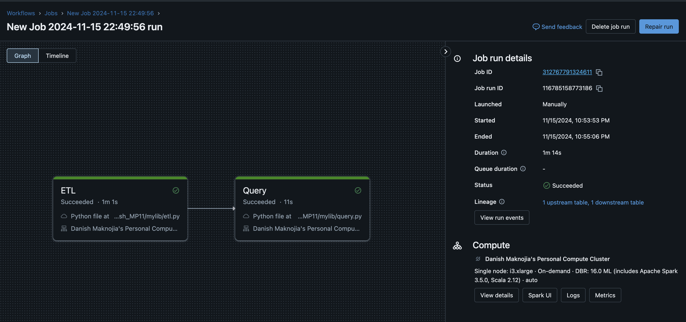

# Maknojia_Danish_MP11

## Requirements:
- Create a data pipeline using Databricks
- Include at least one data source and one data sink

## ETL
The project requires us to build an ETL pipeline (Extract, Transform & Load) and focus on creating a SQL query:

Extract: Raw data is accessed via github repo

Transform & Load: Reads data, processes it, and loads it

Query: Performs CRUD operations (create, read, update, delete) on the database, and logging each SQL query to a markdown file (query_log.md). The log_query function appends the executed SQL queries to the log file, while general_query, create_record, update_record, delete_record, and read_data manage data operations within the database.

SQL Query: Running a query on the tables in the database which joins tables and provides valuable insights

## Components

1. Create a cluster on Databricks

2. Create a Github Repo and Import into workspace

3. Design ETL pipeline in workspace follow proper guidelines & implement CI/CD

4. Link jobs in Github repo

5. Run ETL & Check Task Dependencies 
